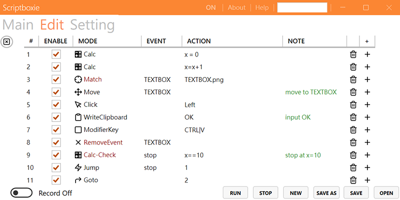

<h1 align="center">Scriptboxie</h1>

Scriptboxie可以讓你輕鬆管理和創建腳本。可以用來簡化重複及耗時的任務。

[English](../README.md) | 中文

 
 

## 特點
- 輕鬆管理和創建腳本
- 腳本錄製
- 圖片搜尋

<h1 align="center">如何使用</h1>

編輯腳本: 就是輸入你想使用的鍵盤滑鼠動作

完成之後,你可以將它保存成一個.txt檔案

 

還有圖像搜尋, 計算... 其他的功能,

可以搭配事件做出不同的變化

 

設定腳本: 為你的腳本設定快捷鍵

 

注意

當這個顯示OFF時，快捷鍵會失效。點擊它後將變回ON。

這是為了確保腳本不會被誤執行。

 

更多資訊

 

<h1 align="center">下載</h1>

載點  <https://github.com/gemilepus/Scriptboxie/releases>.

If you like Scriptboxie, you can support it:

[f1]: https://github.com/gemilepus/Scriptboxie/blob/master/Doc/s1.png
[f2]: https://github.com/gemilepus/Scriptboxie/blob/master/Doc/s2.png
[f3]: https://github.com/gemilepus/Scriptboxie/blob/master/Doc/s3.png
[f4]: https://github.com/gemilepus/Scriptboxie/blob/master/Doc/s4.png
[f5]: https://github.com/gemilepus/Scriptboxie/blob/master/Doc/s5.png
[f6]: https://github.com/gemilepus/Scriptboxie/blob/master/Doc/s6.png

<h1 align="center">範例</h1>

自動點擊按鈕

| | |
| ------------- | ----------- |
| 如果想點擊 Submit 這個按鈕 | [![][f1]][f1] |
| 截圖並使用小畫家 [![][f2]][f2] 儲存起來 , 像這張圖片 | [![][f4]][f4] |
| 然後按照這張圖設定 | [![][f5]][f5] Note: 1.概念是暗紅色的指令可以產生事件，其他的接收事件。指令可以綁定事件並根據其成立是否來執行 2.事件(Event)的名稱可以自由命名 |
| 完成 | :) | 

然後讓它一直執行

| | |
| ------------- | ----------- |
| 按照這張圖設定 :) &emsp;&emsp;&emsp;&emsp;&emsp;&emsp;&emsp;&emsp;&emsp;&emsp;| [![][f6]][f6] Note:當事件成立後，它會一直存在。可以使用RemoveEvent移除它|

<h1 align="center">畫面</h1>

 
 

## Credits
- MahApps.Metro - https://github.com/MahApps/MahApps.Metro
- feather - https://github.com/feathericons/feather
- opencvsharp - https://github.com/shimat/opencvsharp
- globalmousekeyhook - https://github.com/gmamaladze/globalmousekeyhook
