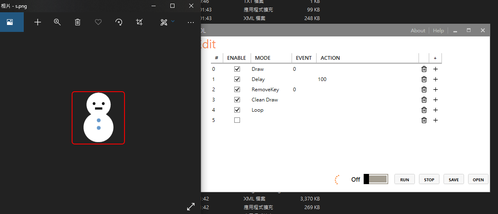
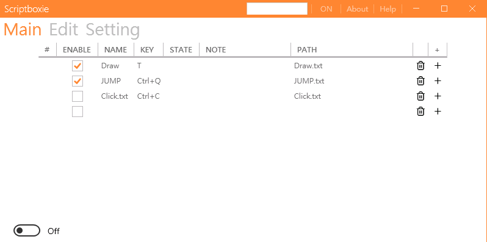
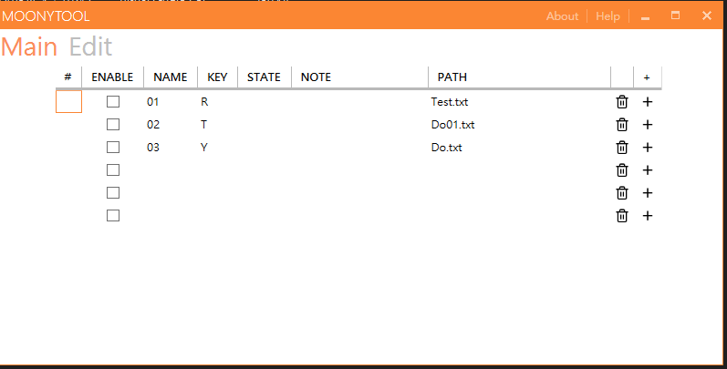
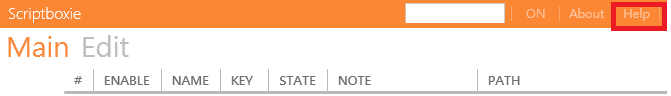

<h1 align="center">Scriptboxie</h1>

This tool allows you to easily control and create tasks,like some mouse macro.

<h1 align="center">Demo</h1>

 

<h1 align="center">Screenshots</h1>

 

 

<h1 align="center">Download</h1>

Download available at <https://github.com/gemilepus/Scriptboxie/releases>.

<h1 align="center">Documentation</h1>

 

