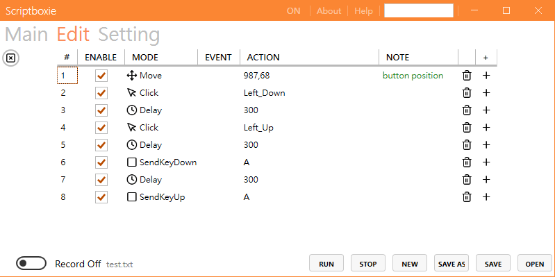
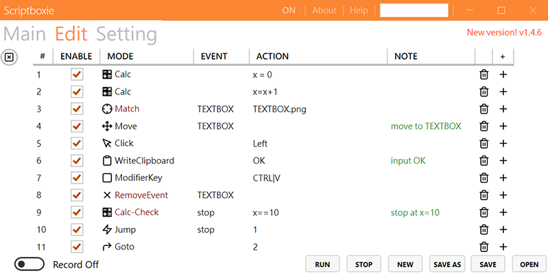
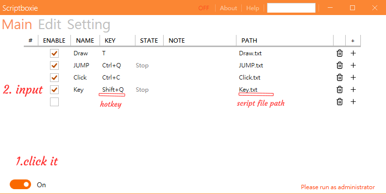
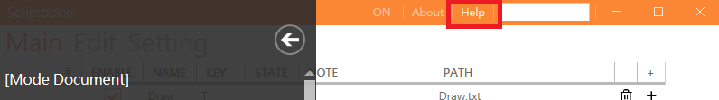
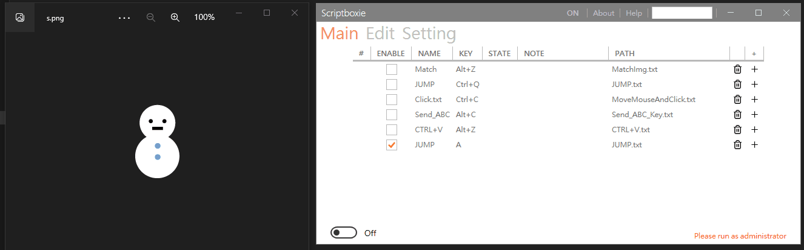
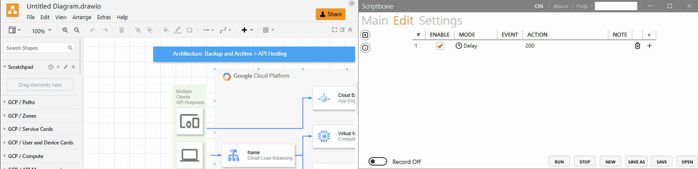

<h1 align="center">Scriptboxie</h1>

This tool allows you to effortlessly manage and craft scripts. Can be used to streamline repetitive and time-consuming tasks.

English | [中文](Doc/README.zh-tw.md)

 
 

## Features
- effortlessly manage and craft scripts
- image search
## Prerequisite
- Windows 10 | 11

<h1 align="center">How to use</h1>

edit script: just enter the keyboard and mouse actions to be use.

After completion, you can save it as a .txt file

 

There are also image search, calculation... and other functions,

which can be used with events to make some variety of actions.

 

setting script: set hotkey for your scripts

 

Notice

When this display OFF,the hotkey will not work.It will change back to ON after clicking it. 

This is to ensure that the script is not executed by mistake.

 

more info

 

<h1 align="center">Download</h1>

Download available at <https://github.com/gemilepus/Scriptboxie/releases>.

If you like Scriptboxie, you can support it:

 
 

[f1]: https://github.com/gemilepus/Scriptboxie/blob/master/Doc/s1.png
[f2]: https://github.com/gemilepus/Scriptboxie/blob/master/Doc/s2.png
[f3]: https://github.com/gemilepus/Scriptboxie/blob/master/Doc/s3.png
[f4]: https://github.com/gemilepus/Scriptboxie/blob/master/Doc/s4.png
[f5]: https://github.com/gemilepus/Scriptboxie/blob/master/Doc/s5.png
[f6]: https://github.com/gemilepus/Scriptboxie/blob/master/Doc/s6.png

<h1 align="center">Example</h1>

Automatically click the button

| | |
| ------------- | ----------- |
| if you want to click the Submit button | [![][f1]][f1] |
| take a screenshot and use [![][f2]][f2] save it , like this picture| [![][f4]][f4] |
| then refer to this picture to set | [![][f5]][f5] Note: 1.The concept is that dark red command can generate events,and others receive events.  Command can bound to event and executed according to whether that  is established or not. 2.event name can be named freely |
| done | :) | 

Then let it alway running

| | |
| ------------- | ----------- |
| refer to this picture to set :) &emsp;&emsp;&emsp;&emsp;&emsp;&emsp;&emsp;&emsp;&emsp;&emsp;| [![][f6]][f6] Note:After the Event is established, it will always exist.You can use RemoveEvent to invalidate it |

<h1 align="center">WIKI</h1>

- [Example](https://github.com/gemilepus/Scriptboxie/wiki/Example)
  - [Click all the button on the screen](https://github.com/gemilepus/Scriptboxie/wiki/Example#click-all-the-button-on-the-screen)
  - [Mouse drag](https://github.com/gemilepus/Scriptboxie/wiki/Example#mouse-drag)
- [Note](https://github.com/gemilepus/Scriptboxie/wiki/Note)
  - [Make hotkeys only work in specific windows](https://github.com/gemilepus/Scriptboxie/wiki/Note)

<h1 align="center">Screenshots</h1>

 
 

## Credits
- MahApps.Metro - https://github.com/MahApps/MahApps.Metro
- feather - https://github.com/feathericons/feather
- opencvsharp - https://github.com/shimat/opencvsharp
- globalmousekeyhook - https://github.com/gmamaladze/globalmousekeyhook
