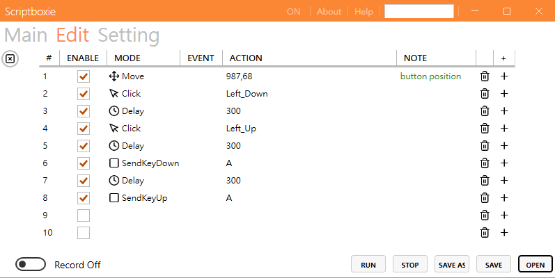
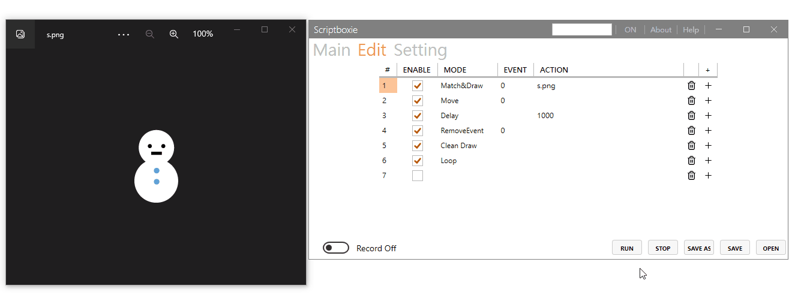
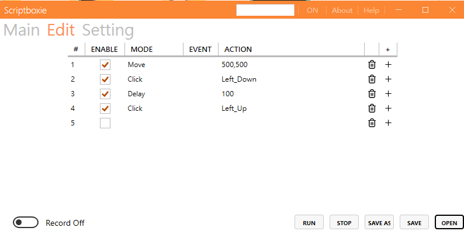

<h1 align="center">Scriptboxie</h1>

This tool allows you to easily control and create scripts, similar to some mouse macros.

 

<h1 align="center">How to use</h1>

edit script: just enter the keyboard and mouse actions to be use

 

setting script 

 

more info

 

<h1 align="center">Demo</h1>

 
 

<h1 align="center">Download</h1>

Download available at <https://github.com/gemilepus/Scriptboxie/releases>.

If you like Scriptboxie, you can support it:

<!--
<h1 align="center">Screenshots</h1>

 

 

-->

